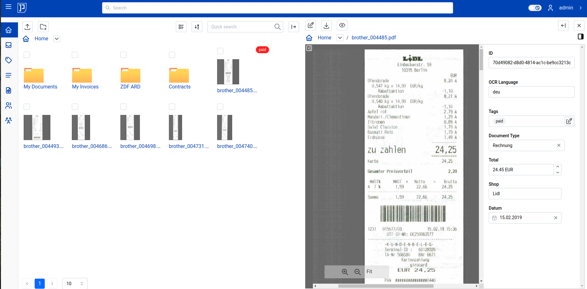

# Papermerge OSS

Papermerge OSS (Open Source) is a document management system for scanned
documents, with OCR, full-text search, tags, folders, and a desktop-like web UI.

**Status:** Actively maintained by the [community maintainer team](MAINTAINERS.md). Originally created by
[Eugen Ciur](https://github.com/ciur), who now focuses on Papermerge Cloud (SaaS).

- 🛠️ Want to contribute? See [CONTRIBUTING.md](CONTRIBUTING.md)
- 🐛 Found a bug or have a feature idea? [Open an issue](https://github.com/papermerge/papermerge-core/issues)
- 💬 Questions or ideas? Join the [Discussions](https://github.com/papermerge/papermerge-core/discussions)

> **Note:** This repository is the open-source, self-hosted, community-maintained edition.
> [Papermerge Cloud (SaaS)](https://papermerge.com) is a separate managed service with
> its own codebase. The two do not share code, so features and release
> schedules may differ.

--------------------------

Papermerge OSS (Open Source) is designed to work with scanned documents (also called digital archives). It
extracts text from your scans using OCR, indexes
them, and prepares them for full-text search. It provides the look and feel
of modern desktop file browsers. It has features like dual-panel document
browser, drag and drop, tags, hierarchical folders and full-text search so that
you can efficiently store and organize your documents.

It supports PDF, TIFF, JPEG and PNG, and is a perfect tool for long-term
storage of your documents.

<p align="center">

</p>

## Feature Highlights

- Web UI with desktop-like experience
- OpenAPI-compliant REST API
- Works with PDF, JPEG, PNG and TIFF documents
- Document versioning
- Tags - assign colored tags to documents or folders
- Documents and folders - users can organize documents in folders
- Document types (i.e. categories)
- Custom fields (metadata) per document type
- Multi-user
- Group ownership
- Share documents and folders between users and/or groups of users
- UI is available in multiple languages
- Page management - delete, reorder, cut, move, extract pages
- OCR (Optical Character Recognition) of the documents
- OCRed text overlay (you can download documents with an OCRed text overlay)
- Full-text search of the scanned documents

## Docker Setup

To start Papermerge OSS (Open Source) with the most basic setup, use the following command:

```bash
docker run -p 8000:80 \
    -e PAPERMERGE__SECURITY__SECRET_KEY=abc \
    -e PAPERMERGE__AUTH__PASSWORD=123 \
    papermerge/papermerge:3.5.3
```

The secret key and password above are for a quick local try-out only. Replace them
with your own values for any real deployment.

For more info about various deployment scenarios,
check the [documentation page](https://docs.papermerge.io/latest).

## Development

Want to run Papermerge OSS (Open Source) from source? The development setup (PostgreSQL, environment
variables, backend and frontend, running tests, CLI commands like `uv run pm search build`,
pre-commit hooks) and the contribution workflow are described in
[CONTRIBUTING.md](CONTRIBUTING.md).
