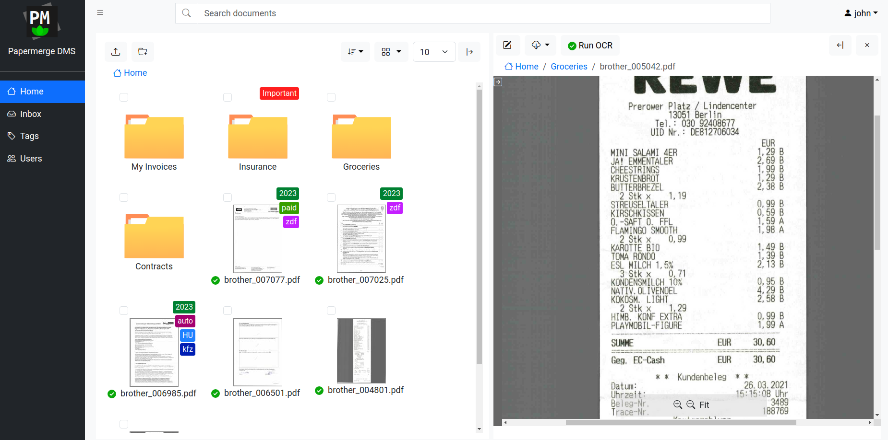

<h1 align="center">Papermerge DMS</h1>

Papermerge DMS or simply Papermerge is a open source document management system
designed to work with scanned documents (also called digital archives). It
extracts text from your scans using OCR, indexes
them, and prepares them for full text search. Papermerge provides the look and feel
of modern desktop file browsers. It has features like dual panel document
browser, drag and drop, tags, hierarchical folders and full text search so that
you can efficiently store and organize your documents.

It supports PDF, TIFF, JPEG and PNG document file formats.
Papermerge is perfect tool for long term storage of your documents.

## Features Highlights

* Web UI with desktop like experience
* OpenAPI compliant REST API
* Works with PDF, JPEG, PNG and TIFF documents
* OCR (Optical Character Recognition) of the documents (uses [OCRmyPDF](https://github.com/ocrmypdf/OCRmyPDF))
* OCRed text overlay (you can download document with OCRed text overlay)
* Full Text Search of the scanned documents (supports [Solr](https://solr.apache.org/) backend, uses [Xapian](https://getting-started-with-xapian.readthedocs.io/en/latest/) by default)
* Document Versioning
* Tags - assign colored tags to documents or folders
* Documents and Folders - users can organize documents in folders
* Multi-User
* Page Management - delete, reorder, cut & paste pages (uses [PikePDF](https://github.com/pikepdf/pikepdf))

## Documentation

Papermerge DMS documentation is available at [https://docs.papermerge.io](https://docs.papermerge.io/)

## Docker

In order to start Papermerge REST API server as docker image use following command:

    docker run -p 8000:80 \
        -e PAPERMERGE__SECURITY__SECRET_KEY=abc \
        -e PAPERMERGE__AUTH__PASSWORD=123 \
        papermerge/papermerge:3.0.3

If you want initial superuser to have another username (e.g. john), use
`PAPERMERGE__AUTH__USERNAME` environment variable:

    docker run -p 8000:80 \
        -e PAPERMERGE__SECURITY__SECRET_KEY=abc \
        -e PAPERMERGE__AUTH__PASSWORD=123 \
        -e PAPERMERGE__AUTH__USERNAME=john \
        papermerge/papermerge:3.0.3

Note that above docker command start only web UI. In order to run OCR on the documents you need at least one
worker instance.

## Docker Compose

Here is an example of complete setup with web ui, one worker (which performs OCR), and PostgreSQL database for
storing data:

      version: "3.9"

      x-backend: &common
        image: papermerge/papermerge:3.0.3
        environment:
            PAPERMERGE__SECURITY__SECRET_KEY: 12345
            PAPERMERGE__AUTH__USERNAME: john
            PAPERMERGE__AUTH__PASSWORD: hohoho
            PAPERMERGE__DATABASE__URL: postgresql://scott:tiger@db:5432/mydatabase
            PAPERMERGE__REDIS__URL: redis://redis:6379/0
        volumes:
          - index_db:/core_app/index_db
          - media:/core_app/media
      services:
        web:
          <<: *common
          ports:
           - "12000:80"
          depends_on:
            - redis
            - db
        worker:
          <<: *common
          command: worker
        redis:
          image: redis:6
        db:
          image: bitnami/postgresql:16.1.0
          volumes:
            - postgres_data:/var/lib/postgresql/data/
          environment:
            POSTGRESQL_USER: scott
            POSTGRESQL_PASSWORD: tiger
            POSTGRESQL_POSTGRES_PASSWORD: tiger
            POSTGRESQL_DATABASE: mydatabase
      volumes:
        postgres_data:
        index_db:
        media:

Open your web browser and point it to http://localhost:12000.

Following docker compose file starts Papermerge (web UI and one worker) with
MariaDB as database and Solr as search engine backend:

    version: "3.9"

    x-backend: &common
      image: papermerge/papermerge:3.0.3
      environment:
          PAPERMERGE__SECURITY__SECRET_KEY: 1234  # top secret
          PAPERMERGE__AUTH__USERNAME: eugen
          PAPERMERGE__AUTH__PASSWORD: 1234
          PAPERMERGE__DATABASE__URL: mysql://myuser:mypass@db:3306/paperdb
          PAPERMERGE__REDIS__URL: redis://redis:6379/0
          PAPERMERGE__SEARCH__URL: solr://solr:8983/pmg-index
      volumes:
        - media_root:/core_app/media
      depends_on:
        - redis
        - solr
        - db

    services:
      web:
        <<: *common
        ports:
         - "12000:80"
      worker:
        <<: *common
        command: worker
      redis:
        image: redis:6
      solr:
        image: solr:9.3
        ports:
         - "8983:8983"
        volumes:
          - solr_data:/var/solr
        command:
          - solr-precreate
          - pmg-index
      db:
        image: mariadb:11.2
        volumes:
          - maria:/var/lib/mysql
        environment:
          MYSQL_ROOT_PASSWORD: mypass
          MYSQL_DATABASE: paperdb
          MYSQL_USER: myuser
          MYSQL_PASSWORD: mypass
    volumes:
      maria:
      solr_data:
      media_root:

Open your web browser and point it to http://localhost:12000.

## Ansible Playbook

In order to deploy Papermerge on remote production machine (homelab VM, or cloud VPS instance)
use following [Ansible Playbook](https://github.com/papermerge/ansible).

## Tests

    poetry install
    poetry shell
    pytest tests/

## Linting

Use following command to make sure that your code is formatted per PEP8 spec:

    poetry run task lint
